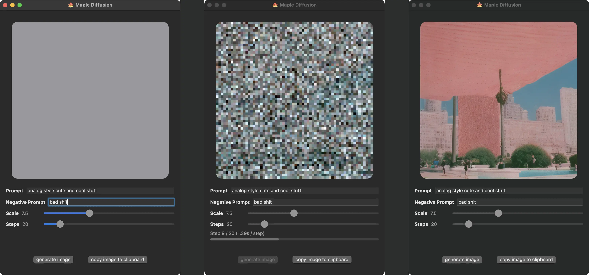

# 🍁 maple diffusion

Maple Diffusion runs Stable Diffusion models **locally** on macOS / iOS
devices, in Swift, using the MPSGraph framework (not Python).



- ~1.4s / step on an M1 MacBook Air (base).
- ~2.3s / step on an iPhone 13 Pro

To attain usable performance without tripping over iOS's 4GB memory limit,
Maple Diffusion relies internally on FP16 (NHWC) tensors, operator fusion from
MPSGraph, and a truly pitiable degree of swapping models to device storage.

On macOS, Maple Diffusion uses slightly more (~6GB) memory.

# device requirements

Maple Diffusion should run on any Apple Silicon Mac (M1, M2, etc.). Intel Macs
should also work now thanks to [this pull request][intelpr].

Maple Diffusion should run on any iOS device with [sufficient RAM][iosram]
(≥6144MB RAM definitely works; 4096MB [doesn't][issue25]). That means recent
iPads should work out of the box, and recent iPhones should work if you can
get the `Increase Memory Limit` capability working (to unlock 4GB of
app-usable RAM). iPhone 14 variants reportedly didn't work until
[iOS 16.1 stable][issue5comment0].

Maple Diffusion doesn't expect Xcode for macOS builds. `swiftc` is enough.
However, **Xcode 14** and **iOS 16** are required iOS builds. Other versions
may require changing build settings or just not work. iOS 16.1 (beta) was
reportedly [broken][issue8] and always generating a gray image, but I think
that's fixed.

## usage

To build and run Maple Diffusion:

1. Download a Stable Diffusion PyTorch model checkpoint ([`sd-v1-4.ckpt`][sd14],
   or some derivation thereof)
2. Download this repo
```bash
git clone https://github.com/0ihsan/maple-diffusion.git && cd maple-diffusion
```
3. Convert the ckpt to bin files: Setup & install Python with PyTorch, if you
   haven't already. (WARNING: this script deletes conda env named
   `maple-diffusion` if exists).
```bash
# may need to install conda first https://github.com/conda-forge/miniforge#homebrew
conda deactivate
conda remove -n maple-diffusion --all
conda create -n maple-diffusion python=3.10
conda activate maple-diffusion
pip install torch typing_extensions numpy Pillow requests pytorch_lightning
```
4. Convert the PyTorch model checkpoint into a bunch of fp16 binary blobs.
```bash
./maple-convert.py ~/Downloads/sd-v1-4.ckpt
```
5. Run `make` (for macOS).

This will create a directior called `sd.app`.
It creates a simple app which you can copy to `/Applications` folder.
It copies the `bins/` (model) to the app's `Resources` directory so the app is standalone.

### or build with xcode

- 5] Open the `maple-diffusion` Xcode project. Select the device you want to
     run on from the `Product > Destination` menu.
- 6] [Manually add][issue5comment1] the `Increased Memory Limit` capability to
     the `maple-diffusion` target (this step might not be needed on iPads, but
     it's definitely needed on iPhones - the default limit is 3GB).
- 7] Build & run the project on your device with the `Product > Run` menu.

## related projects

* **Native Diffusion** ([repo][nativediffusion]) is a Swift Package-ified
  version of this codebase with several improvements (including image-to-image)
* **Waifu Art AI** ([announcement][waifuartai], [App Store link][waifuartappstore])
  is an iOS / macOS app for (anime-style) Stable Diffusion
  based on this codebase
* **Draw Things** ([announcement][drawthings], [App Store link][drawthingsappstore])
  is an iOS app for Stable Diffusion (using an independent
  codebase with similar MPSGraph-based approach)

[sd14]: https://huggingface.co/CompVis/stable-diffusion-v1-4
[iosram]: https://blakespot.com/ios_device_specifications_grid.html
[issue8]: https://github.com/madebyollin/maple-diffusion/issues/8
[nativediffusion]: https://github.com/mortenjust/native-diffusion/
[issue25]: https://github.com/madebyollin/maple-diffusion/issues/25
[waifuartai]: https://twitter.com/dgspitzer/status/1596652212964712449
[intelpr]: https://github.com/madebyollin/maple-diffusion/pull/14#issuecomment-1282166802
[drawthingsappstore]: https://apps.apple.com/us/app/draw-things-ai-generation/id6444050820
[waifuartappstore]: https://apps.apple.com/us/app/waifu-art-ai-local-generator/id6444585505
[issue5comment0]: https://github.com/madebyollin/maple-diffusion/issues/5#issuecomment-1304410263
[issue5comment1]: https://github.com/madebyollin/maple-diffusion/issues/5#issuecomment-1279111878
[drawthings]: https://liuliu.me/eyes/stretch-iphone-to-its-limit-a-2gib-model-that-can-draw-everything-in-your-pocket/
